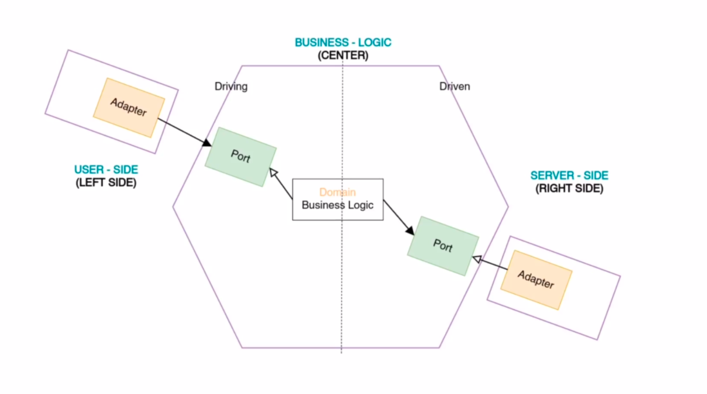
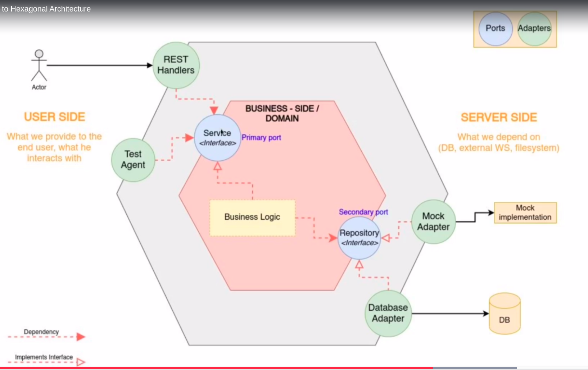

# Notes

General notes on the course [REST based micro-services API development in Golang](https://www.udemy.com/course/rest-based-microservices-api-development-in-go-lang/) 

---

## Hexagonal arch

Hexagonal arch is not very complicated.

* Separate the code in 3 large areas
  * User side
  * Business side: isolated from both sites
  * Server side
* Connected via port, adapters
* Dependencies go inside the center

*Port*: is an interface

On the next use case diagram is shown what we're going to build:

* User or test sending the request
* All ports are defined as interfaces
  * use loose coupling
* Can use mock implementation instead of server
* Can use business logic cut from the rest of the world

For more information see [this article](https://www.qwan.eu/2020/08/20/hexagonal-architecture.html).

---

## DTO Notes

* The communication between business & user side  uses the DTO layer.
* improves modularity & prevents object scattering.
* Transformation on business side, on server port (see Hex_arch_notes.md)

